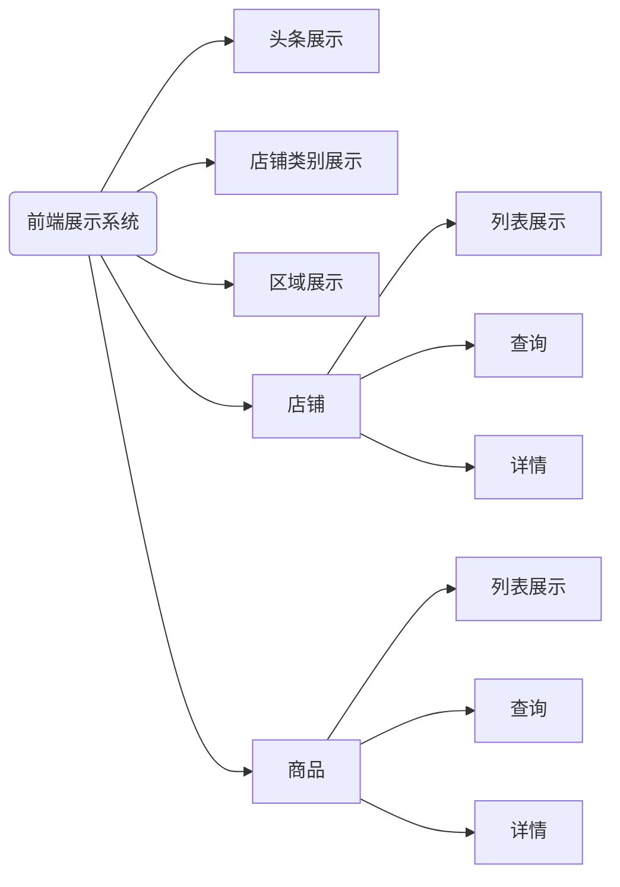
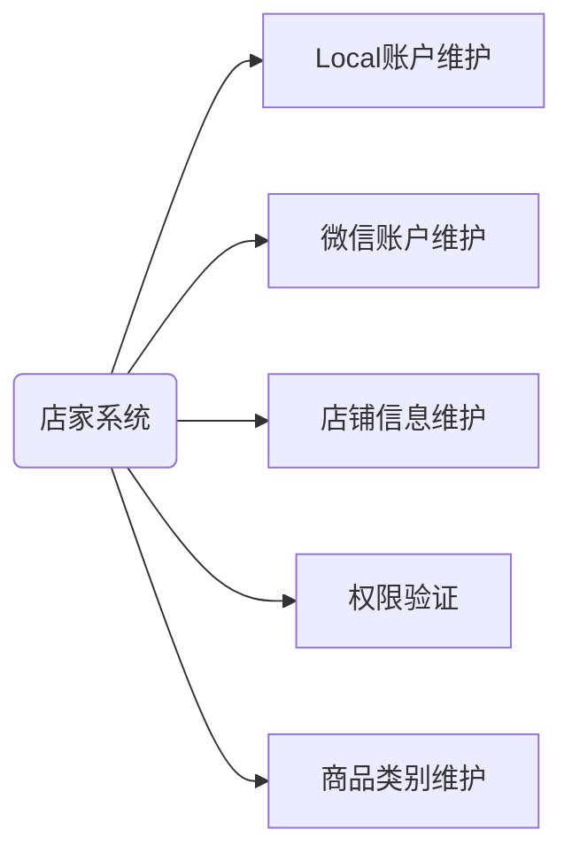
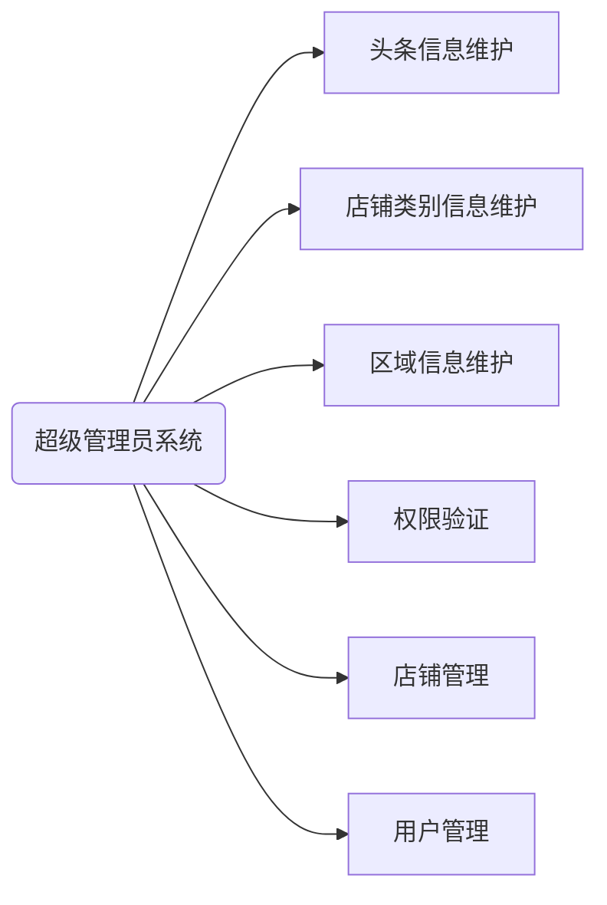

```mermaid
graph  LR
a(前端展示系统) --> b[头条展示]
    a --> c[店铺类别展示]
    a --> d[区域展示]
    a --> e[店铺]
        e --> e1[列表展示]
        e --> e2[查询]
        e --> e3[详情]
    a --> f[商品]
        f-->f1[列表展示]
        f-->f2[查询]
        f-->f3[详情]
```

```mermaid
graph  LR
a(店家系统) --> b[Local账户维护]
a-->c[微信账户维护]
a-->d[店铺信息维护]
a-->e[权限验证]
a-->f[商品类别维护]
```

```mermaid
graph  LR
a(超级管理员系统) --> b[头条信息维护]
a-->c[店铺类别信息维护]
a-->d[区域信息维护]
a-->e[权限验证]
a-->f[店铺管理]
a-->g[用户管理]
```