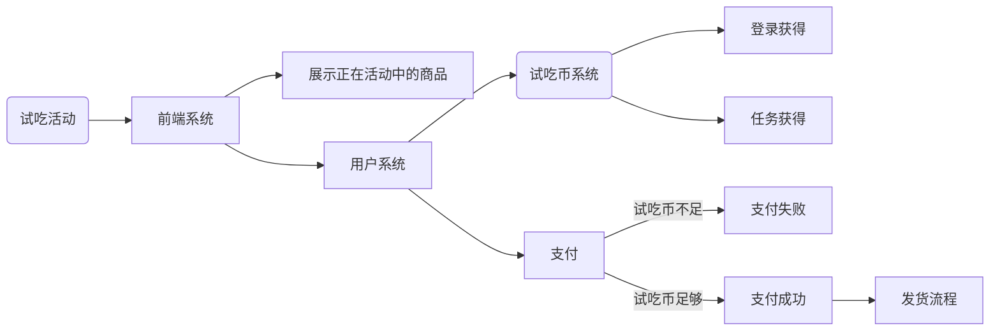
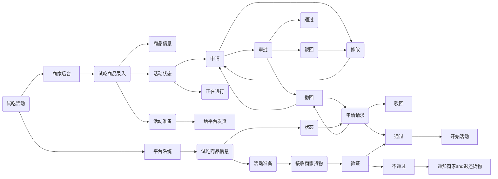
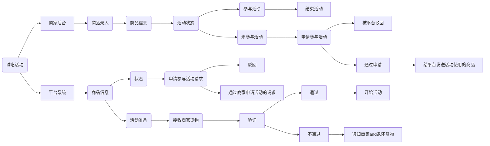

```mermaid
graph LR
    a(试吃活动)  --> d[前端系统] --> 展示正在活动中的商品
            d --> u[用户系统]
                u --> m(试吃币系统)
                    m --> 登录获得
                    m --> 任务获得
                u --> f[支付]
                    f-->|试吃币不足| 支付失败
                    f-->|试吃币足够| 支付成功 --> 发货流程
```

```mermaid
graph  LR
a(试吃活动) -->b[商家后台]
        b--> b1(试吃商品录入)
            b1 --> info(商品信息)
            b1 --> stat(活动状态)
               stat --> apply(申请)
                    apply --> edit(修改) --> apply
                    apply --> ex(审批)
                        ex --> 撤回 -->capply --> 撤回 --> apply
                        ex --> pass(通过) 
                        ex --> rej(驳回) -->edit
               stat --> last(正在进行)
            b1 --> plan(活动准备)
                plan --> 给平台发货
                          
    a --> c[平台系统]
        c --> c1(试吃商品信息)
            c1 --> cstat(状态)
               cstat --> capply(申请请求)
               capply --> 驳回
               capply --> 通过
            c1 --> cplan(活动准备)
                cplan --> js(接收商家货物)
                        js --> yz[验证]
                            yz --> 通过 -->  开始活动
                            yz --> 不通过 --> 通知商家and退还货物
```

```mermaid
graph  LR
a(试吃活动) -->b[商家后台]
        b--> b1(商品录入)
            b1 --> info(商品信息)
            info --> stat(活动状态)
               stat --> apply(参与活动) --> 结束活动
               stat --> last(未参与活动) --> sq(申请参与活动)
                                        sq --> 被平台驳回
                                        sq --> 通过申请 --> 给平台发送活动使用的商品
     
                          
    a --> c[平台系统]
        c --> c1(商品信息)
            c1 --> cstat(状态)
               cstat --> capply(申请参与活动请求)
               capply --> 驳回
               capply --> 通过商家申请活动的请求
            c1 --> cplan(活动准备)
                cplan --> js(接收商家货物)
                        js --> yz[验证]
                            yz --> 通过 -->  开始活动
                            yz --> 不通过 --> 通知商家and退还货物
```

